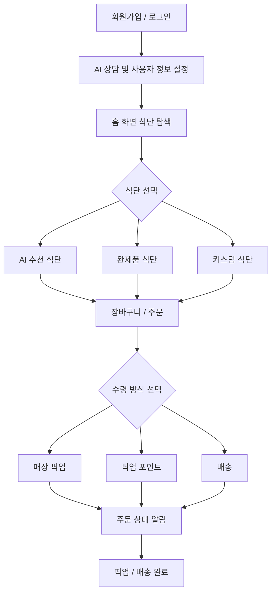
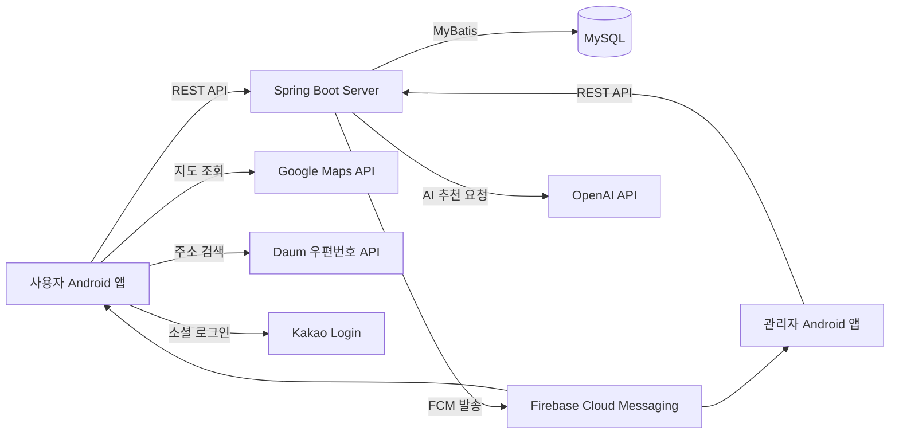

<div align="center">

# 🥗 FitBox

### AI 기반 개인 맞춤 식단 커스터마이징 O2O 플랫폼

사용자의 신체 정보, 식사 목적, 알레르기, 선호도를 바탕으로 식단을 추천하고,  
커스텀 식단 제작부터 단건 주문, 정기 구독, 픽업/배송, 관리자 주문 처리와 알림까지 연결하는 서비스입니다.

<br/>


<br/><br/>

**SSAFY Android Project**  
2026.06 - 2026.06

</div>

---

## 📌 목차

- [프로젝트 소개](#-프로젝트-소개)
- [주요 기능](#-주요-기능)
- [서비스 흐름](#-서비스-흐름)
- [기술 스택](#-기술-스택)
- [시스템 구조](#-시스템-구조)
- [프로젝트 구조](#-프로젝트-구조)
- [실행 방법](#-실행-방법)
- [외부 설정](#-외부-설정)
- [DB](#-db)
- [검증 명령](#-검증-명령)
- [팀원](#-팀원)

---

## 🧾 프로젝트 소개

**FitBox**는 개인 맞춤형 식단을 쉽고 빠르게 구성할 수 있는 O2O 식단 주문 플랫폼입니다.

사용자는 AI 상담을 통해 자신의 식사 목적과 신체 정보를 기반으로 식단을 추천받을 수 있고,  
완제품 식단 주문, 직접 재료를 선택하는 커스텀 식단 제작, 월 단위 정기 구독, 매장 픽업 및 배송 수령까지 진행할 수 있습니다.

관리자는 주문 상태를 관리하고, 픽업 포인트 사물함을 배정하며, 사용자에게 주문 상태 및 픽업 정보를 알림으로 전달할 수 있습니다.

---

## ✨ 주요 기능

### 👤 사용자 기능

| 구분 | 기능 |
|---|---|
| 회원 | 일반 로그인, 카카오 로그인, 회원가입 |
| AI 상담 | 회원가입 단계 AI 상담, 식사 목적 설정, 개인 맞춤 식단 상담 |
| 식단 탐색 | 완제품 식단 조회, 목표별/인기 식단 탐색 |
| 커스텀 | 식재료 직접 선택, 영양 성분 및 가격 계산 |
| 주문 | 장바구니 기반 단건 주문, 월 단위 정기 구독 주문 |
| 수령 | 매장 픽업, 픽업 포인트, 배송 수령 방식 선택 |
| 주소 | Daum 우편번호 API 기반 배송지 등록 |
| 즐겨찾기 | 주문, 구독, AI 추천 식단 저장 |
| 알림 | Firebase FCM 기반 푸시 알림 및 인앱 알림 |
| 픽업 | NFC 태깅 기반 픽업 완료 처리 |

### 🛠 관리자 기능

| 구분 | 기능 |
|---|---|
| 계정 | 관리자 계정 로그인 |
| 주문 관리 | 주문 수락 대기, 진행 중, 픽업 완료 상태별 주문 관리 |
| 상태 처리 | 주문 수락, 준비 완료, 픽업 완료 처리 |
| 픽업 포인트 | 픽업 포인트 사물함 번호 지정 |
| 알림 발송 | 사용자에게 주문 상태 및 픽업 위치 알림 발송 |
| 관리자 알림 | 사용자 픽업 완료 시 관리자 알림 확인 |

---

## 🔄 서비스 흐름



---

## 🔧 주요 구현 포인트

| 구현 항목 | 설명 |
|---|---|
| AI 식단 상담 | OpenAI API를 활용해 사용자 목적과 선호도 기반 식단 상담 및 추천 |
| 개인 영양 목표 | BMR/TDEE 기반 개인 영양 목표 계산 |
| 알레르기 반영 | 알레르기와 취향을 고려한 식단 추천 |
| 지도 기반 수령 | Google Maps 기반 매장 및 픽업 포인트 선택 |
| 잔여 칸 관리 | 날짜별 픽업 포인트 사물함 잔여 칸 관리 |
| 푸시 알림 | Firebase Cloud Messaging 기반 사용자/관리자 알림 |
| 주소 검색 | Daum 우편번호 API 기반 배송지 등록 |
| 소셜 로그인 | Kakao Login 연동 |
| 서버 API | Spring Boot + MyBatis + MySQL 기반 REST API 서버 |

---

## 🧱 기술 스택

### Android

| 기술 | 사용 목적 |
|---|---|
| Kotlin | Android 앱 개발 |
| ViewBinding | XML View 바인딩 |
| Fragment | 화면 단위 구성 |
| ViewModel | 화면 상태 관리 |
| Retrofit2 + Gson | REST API 통신 및 JSON 변환 |
| Glide | 이미지 로딩 |
| Google Maps SDK | 지도 및 매장 위치 표시 |
| Firebase Messaging | 푸시 알림 수신 |
| Kakao SDK | 카카오 로그인 |

### Backend

| 기술 | 사용 목적 |
|---|---|
| Java 21 | 서버 개발 언어 |
| Spring Boot 4 | REST API 서버 구축 |
| MyBatis | SQL Mapper 기반 DB 접근 |
| MySQL | 서비스 데이터 저장 |
| Swagger / Springdoc OpenAPI | API 문서화 및 테스트 |
| Firebase Admin SDK | 서버 기반 FCM 알림 발송 |

---

## 🏗 시스템 구조



---

## 📁 프로젝트 구조

```text
pennant_race_final
├─ app/                         # Android 클라이언트
│  └─ src/main/java/com/ssafy/fitbox
│     ├─ activity               # MainActivity
│     ├─ adapter                # RecyclerView Adapter
│     ├─ dto                    # Android DTO
│     ├─ fragment               # 주요 화면 Fragment
│     ├─ network                # Retrofit API
│     ├─ notification           # FCM 처리
│     ├─ repository             # 데이터 접근 계층
│     └─ util                   # Session, Cache, Helper
│
├─ spring_server/               # Spring Boot 서버
│  └─ src/main
│     ├─ java/com/ssafy/fitbox
│     │  ├─ controller          # REST Controller
│     │  ├─ dto                 # Server DTO
│     │  ├─ mapper              # MyBatis Mapper Interface
│     │  └─ service             # Business Logic
│     └─ resources
│        ├─ Mapper              # MyBatis XML
│        └─ db                  # DB schema / dummy data
```

---

## 🚀 실행 방법

### 1. Backend 실행

```bash
cd spring_server
mvn spring-boot:run
```

기본 서버 주소는 Android 앱의 `RetrofitClient` 설정을 따릅니다.  
로컬/실기기 테스트 시 PC IP와 포트 설정을 확인해야 합니다.

### 2. Android 실행

```bash
./gradlew :app:assembleDebug
```

또는 Android Studio에서 `app` 모듈을 실행합니다.

---

## 🔐 외부 설정

프로젝트 실행을 위해 아래 설정이 필요합니다.

| 항목 | 설명 |
|---|---|
| MySQL | DB 생성 및 더미 데이터 입력 |
| Google Maps API Key | 지도 기능 사용 |
| Firebase | `google-services.json`, FCM 설정 |
| Firebase Admin SDK | 서버 알림 발송용 서비스 계정 파일 |
| Kakao Native App Key | 카카오 로그인 연동 |
| OpenAI API Key | AI 식단 상담 및 추천 |
| Daum 우편번호 API | 배송지 검색 WebView 사용 |

> 민감 정보는 Git에 직접 커밋하지 않고 `local.properties`, 서버 설정 파일, Firebase 설정 파일 등으로 분리해서 관리해야 합니다.

---

## 🗄 DB

DB 스키마와 더미 데이터는 서버 리소스 폴더에 정리되어 있습니다.

```text
spring_server/src/main/resources/db/fitbox_schema_full.sql
spring_server/src/main/resources/db/fitbox_dummy_data_full.sql
```

---

## ✅ 검증 명령

### Android 빌드

```bash
./gradlew :app:assembleDebug
```

### Spring 서버 빌드

```bash
cd spring_server
mvn -DskipTests package
```

---

## 👥 팀원

| 이름 | 역할 |
|---|---|
| 한태원 | Android / Backend / 주문·구독·픽업 기능 구현 |
| 이한준 | Android / Backend / 회원·AI·관리자 기능 구현 |

---

<div align="center">

**FitBox**  
AI 기반 개인 맞춤 식단 커스터마이징 O2O 플랫폼

</div>
